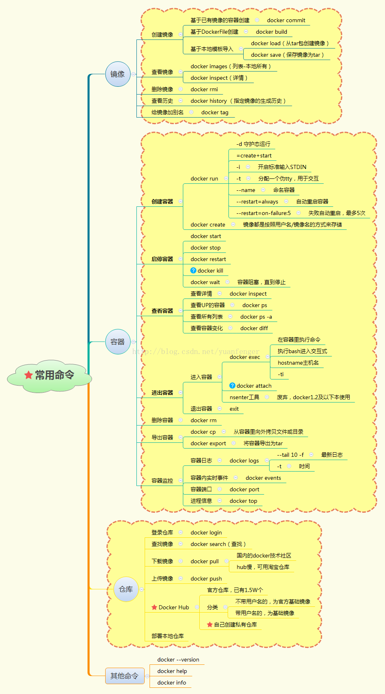

```bash
docker images == docker image ls
docker rmi images-name:tag

docker search image-name
docker pull image-name:tag
docker 
```

### 基本启用

- 启动 docker `service docker start`
- 重启 `service docker restart`
- 关闭 `service docker stop`

# 常用命令

- 学会常用 help 命令或查看 [官方文档说明](https://docs.docker.com/reference/)


```bash
$ docker --help

Usage:  docker COMMAND

A self-sufficient runtime for containers

Options:
      --config string      Location of client config files (default "/root/.docker")
  -D, --debug              Enable debug mode
      --help               Print usage
  -H, --host list          Daemon socket(s) to connect to (default [])
  -l, --log-level string   Set the logging level ("debug", "info", "warn", "error", "fatal") (default "info")
      --tls                Use TLS; implied by --tlsverify
      --tlscacert string   Trust certs signed only by this CA (default "/root/.docker/ca.pem")
      --tlscert string     Path to TLS certificate file (default "/root/.docker/cert.pem")
      --tlskey string      Path to TLS key file (default "/root/.docker/key.pem")
      --tlsverify          Use TLS and verify the remote
  -v, --version            Print version information and quit

Management Commands:
  container   Manage containers
  image       Manage images
  network     Manage networks
  node        Manage Swarm nodes
  plugin      Manage plugins
  secret      Manage Docker secrets
  service     Manage services
  stack       Manage Docker stacks
  swarm       Manage Swarm
  system      Manage Docker
  volume      Manage volumes

Commands:
  attach      Attach to a running container
  build       Build an image from a Dockerfile
  commit      Create a new image from a container's changes
  cp          Copy files/folders between a container and the local filesystem
  create      Create a new container
  diff        Inspect changes on a container's filesystem
  events      Get real time events from the server
  exec        Run a command in a running container
  export      Export a container's filesystem as a tar archive
  history     Show the history of an image
  images      List images
  import      Import the contents from a tarball to create a filesystem image
  info        Display system-wide information
  inspect     Return low-level information on Docker objects
  kill        Kill one or more running containers
  load        Load an image from a tar archive or STDIN
  login       Log in to a Docker registry
  logout      Log out from a Docker registry
  logs        Fetch the logs of a container
  pause       Pause all processes within one or more containers
  port        List port mappings or a specific mapping for the container
  ps          List containers
  pull        Pull an image or a repository from a registry
  push        Push an image or a repository to a registry
  rename      Rename a container
  restart     Restart one or more containers
  rm          Remove one or more containers
  rmi         Remove one or more images
  run         Run a command in a new container
  save        Save one or more images to a tar archive (streamed to STDOUT by default)
  search      Search the Docker Hub for images
  start       Start one or more stopped containers
  stats       Display a live stream of container(s) resource usage statistics
  stop        Stop one or more running containers
  tag         Create a tag TARGET_IMAGE that refers to SOURCE_IMAGE
  top         Display the running processes of a container
  unpause     Unpause all processes within one or more containers
  update      Update configuration of one or more containers
  version     Show the Docker version information
  wait        Block until one or more containers stop, then print their exit codes

Run 'docker COMMAND --help' for more information on a command.
```

### 基本命令

#### 仓库相关操作

```bash
docker pull     #从远程仓库拉取镜像到本地
docker push     #推送本地镜像到远程仓库
docker search   #在仓库搜索镜像
docker login    #登录到官方仓库Docker Hub
docker logout   #退出登录
```

#### 镜像相关操作

```bash
docker build    #从Dockerfile构建镜像
docker pull     #同上
docker push     #同上
docker history  #显示镜像的历史信息
docker images   #列出镜像
docker rmi      #删除镜像
docker tag      #给镜像打上tag标签
docker run      #创建容器并启动容器
docker create   #创建容器
docker commit   #将修改后的容器生成镜像
docker load     #从压缩包中加载镜像
docker import   #从归档文件中创建镜像
docker save     #将镜像保存到压缩文件
```

#### 容器相关操作

```bash
docker attach   #依附到一个正在运行的容器中
docker exec     #进到正在运行的容器中执行命令
docker cp       #在容器和本地系统间复制文件
docker update   #将一个容器内所有的进程从暂停状态中恢复
docker ps       #列出主机中的容器
docker port     #查找一个nat到私有网口的公共口
docker top      #查看一个容器中正在运行的进程信息
docker logs     #查看日志文件
docker diff     #检查容器内文件系统的修改
docker status   #输出容器的资源使用统计信息
docker wait     #阻塞直到容器终止
docker start    #启动已创建的容器
docker pause    #暂停运行中的容器
docker unpause  #使暂停的容器恢复运行
docker stop     #停止容器运行
docker rename   #容器改名
docker restart  #容器重启
docker kill     #关闭运行中的容器
docker rm       #删除容器
docker export   #导出容器内容为tar包
docker run      #同上
docker create   #同上
docker commit   #同上
```

#### 其他基本命令

```bash
docker events   #从服务端获取实时的事件
docker info     #查看系统相关信息
docker inspect  #显示Docker对象的具体配置信息，包括容器，镜像，网络等
docker version  #输出Docker的版本信息
```

#### 管理命令

```bash
docker container    #容器管理
docker image        #镜像管理
docker network      #网络管理
docker node         #节点管理
docker plugin       #插件管理
docker secret       #管理敏感数据及普通服务配置项
docker service      #服务管理
docker stack        #栈管理
docker swarm        #集群管理
docker system       #管理系统信息
docker volume       #卷管理
```

### 一些命令图帮助大家记忆理解




