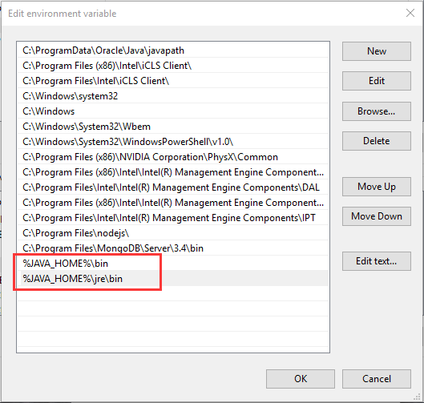

[TOC]

# windwos 10 init steps

__todo__

__<https://zhuanlan.zhihu.com/p/66231005>__


## softwares

- ssr
- chrome
- vs code
    - system install
    - add path
    - not add right menu
- IDM
- bandzip
- musictools
- Tecent DeskGo
- `wsl`
    - add to right menu 
- wsl-terminal
    - add to right menu 
- mactype
    - 注册表加载


## commands


```bash
:1,$ s/archive.ubuntu.com/mirrors.aliyun.com/g
#将str1替换为str2
:1,$ s/str1/str2/g
```

```bash
#复制文件内容到win剪贴板
cat foo.txt | clip.exe
```


```bash
git config --global user.email "b19g3r@gmail.com"
git config --global user.name "b19g3r"
```

- proxy

```bash
# ~/.bashrc 或 ~/zshrc
export http_proxy="http://127.0.0.1:1080"
export https_proxy="http://127.0.0.1:1080"


alias proxy="export ALL_PROXY=socks5://127.0.0.1:1080"
alias unproxy="unset ALL_PROXY"
```

- git proxy

```bash
git config --global https.proxy http://127.0.0.1:1080

git config --global https.proxy https://127.0.0.1:1080

git config --global --unset http.proxy

git config --global --unset https.proxy
```

- curl proxy
  - [see](https://linux.cn/article-9223-1.html)

```
curl --socks5 127.0.0.1:1080 https://www.cyberciti.biz/
```

- ssh

``` bash
ssh-keygen -t rsa -C "youremail@example.com"
```


### `wsl`

- [ ] ubuntu on the windows store

- [ ] update the `/etc/apt/sources.list` and update

  `sudo cp sources.list /etc/apt/sources.list`

- [ ] config vim

- [ ] install zsh and oh-my-zsh or fish and oh-my-fish

  `sudo apt install fish`


### scoop

>### Installing Scoop to Custom Directory
>
>Assuming the target directory is `C:\scoop`, in a PowerShell command console, run:
>
>```powershell
>$env:SCOOP='C:\scoop'
>[environment]::setEnvironmentVariable('SCOOP',$env:SCOOP,'User')
>iex (new-object net.webclient).downloadstring('https://get.scoop.sh')
>```
>
>Assuming you didn't see any error messages, Scoop is now ready to run.
>
>### Installing global apps to custom directory
>
>Assuming the target directory is `C:\apps`, in a admin-enabled PowerShell command console, run:
>
>```powershell
>$env:SCOOP_GLOBAL='c:\apps'
>[environment]::setEnvironmentVariable('SCOOP_GLOBAL',$env:SCOOP_GLOBAL,'Machine')
>scoop install -g <app>
>```

- scoop list

```powershell
Installed apps:

  7zip 19.00
  bat 0.11.0
  curl 7.65.3
  git 2.22.0.windows.1
  less 551
  sudo 0.2018.07.25
  vim 8.1.1773
```


## config

### terminal and cmd

- color
    - solorized dark
- software
    - scoop
    - wsl

### environment

```bash
# 修改shell为zsh
chsh -s /bin/zsh
```

## fonts
- Monaco

- powerline fonts

  ```bash
  sudo apt-get install fonts-powerline
  # or install manually
  git clone https://github.com/powerline/fonts.git --depth=1
  cd fonts
  ./install.sh
  ```

  

## Shell

### fish shell

To install fish, run the following commands:

```bash
sudo apt-add-repository ppa:fish-shell/release-3
sudo apt-get update
sudo apt-get install fish
```

### oh-my-fish

```bash
curl --socks5 127.0.0.1:1080 -L github.com/oh-my-fish/oh-my-fish/raw/master/bin/install | fish
```

- omf commands
  - install plugin

    `omf install XXX`

  - change theme

    `omf theme xxx`

  - 

### [zsh](<https://blog.jae.sh/article/zqle60.html>)

```bash
#  安装zsh
apt-get install zsh -y
# 修改shell为zsh
chsh -s /bin/zsh
# 安装oh-my-zsh
wget https://github.com/robbyrussell/oh-my-zsh/raw/master/tools/install.sh -O - | sh

# 安装配置 autojump
apt-get install autojump -y
echo '. /usr/share/autojump/autojump.sh'>>~/.zshrc

# 安装 zsh 插件
git clone https://github.com/zsh-users/zsh-syntax-highlighting.git ${ZSH_CUSTOM:-~/.oh-my-zsh/custom}/plugins/zsh-syntax-highlighting

git clone git://github.com/zsh-users/zsh-autosuggestions $ZSH_CUSTOM/plugins/zsh-autosuggestions
# 编辑 .zshrc, add plugin
 plugins=(git zsh-syntax-highlighting zsh-autosuggestions)

```

```bash
sudo passwd
sudo cp sources.list /etc/apt/sources.list
sudo apt install fish
which fish
chsh -s /usr/bin/fish
curl --socks5 127.0.0.1:1080 -L https://get.oh-my.fish | fish
omf install robbyrussell
```

```bash
sudo apt-get install mariadb-server
sudo service mysql restart
su -
# 输入密码
mysql
# 创建一个名为：admin  密码为：admin  的用户。
insert into mysql.user(Host,User,Password) values("localhost","admin",password("admin"));
# 刷新权限
flush privileges;
# 赋予admin用户所有权限
GRANT ALL ON *.* TO 'admin'@'localhost';
#local login
mysql –uadmin –padmin
#remote login
mysql -uadmin -h127.0.0.1 -padmin
# 删除用户及所有权限
DROP USER account;
```


```bash
#alias begin
alias curl='curl --socks5 127.0.0.1:1080'
alias db='sudo service mysql restart'
#alias end
```

```bash
#创建软连接
ln -s /mnt/d/ d
```

## auto mount

>不过每次使用时都要重新挂载未免也太烦，我们可以通过另一个新特性 [Automatically Configuring WSL](https://blogs.msdn.microsoft.com/commandline/2018/02/07/automatically-configuring-wsl/) 实现自动挂载。在 WSL 中创建 `/etc/wsl.conf`，在其中填写如下内容：
>
>```bash
>[automount]
>enabled = true
>root = /mnt/
>options = "metadata,umask=22,fmask=111"
>mountFsTab = true
># 这个文件里还可以添加其他配置项，有兴趣的可以看看上面的链接
>```
>
>重启终端，所有的盘符就会使用上面的配置自动挂载啦（可以使用 `mount -l` 查看）。
>
>另外，如果你想要给不同的盘符设定不同的挂载参数（上面的方法对所有盘符都有效，如果你想在 WSL 中运行 Windows 下的应用程序，就得每次都 `chmod +x` 一下，所以我一般都会把 `C:` 排除掉），就需要手动修改 `/etc/fstab`。首先确保 `wsl.conf` 中的 `mountFsTab` 为 `true`，然后编辑 `/etc/fstab`，添加如下内容：
>
>```
># 不在此列表中的盘符会使用 wsl.conf 中的参数挂载
># 格式可以自己去查 fstab 的帮助文档
>E: /mnt/e drvfs rw,relatime,uid=1000,gid=1000,metadata,umask=22,fmask=111 0 0
>```
>

## dircolors

> see `https://awesomeopensource.com/project/trapd00r/LS_COLORS#fish-shell`

```bash
#bash or zsh
eval $(dircolors -b $HOME/.config/dircolors/.dircolors.wsl)

#fish
#Place it in ~/.config/fish/config.fish or any *.fish* file inside ~/.config/fish/conf.d/ to be loaded.
eval (dircolors --c-shell $HOME/.dircolors) 
```


## Windows

### 环境变量

#### java

```
变量名：JAVA_HOME
变量值：电脑上JDK安装的绝对路径
```


```
变量名：CLASSPATH
变量值：.;%JAVA_HOME%\lib\dt.jar;%JAVA_HOME%\lib\tools.jar;
```


```
# Path 新增
%JAVA_HOME%\bin
%JAVA_HOME%\jre\bin
```



```bat
#验证
java -version
javac -version
```

#### maven

```
 MAVEN_HOME=maven source folder
 Path=Path + "%MAVEN_HOME%\bin"
```

